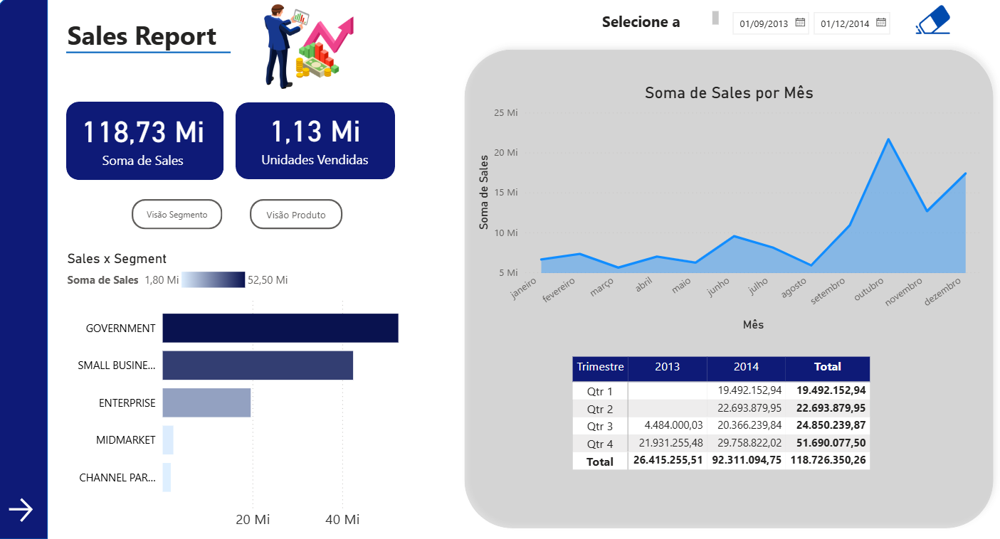

# 📊 Dashboard Gerencial – Foco na Experiência do Usuário | Power BI

🎯 Objetivo do Desafio

Refatorar o relatório original priorizando:

✅ Posicionamento dos elementos

✅ Contraste adequado para destacar informações

✅ Uso da Proporção Áurea para alinhamento e equilíbrio visual

✅ Segmentação inteligente dos dados

✅ Criatividade e liberdade visual ao "quebrar regras" quando necessário

O foco foi criar um dashboard mais limpo, interativo, intuitivo e eficiente para tomada de decisão.

🚀 Entregas Realizadas
Item	Descrição

✅ Ajuste completo do layout com foco em UX	

✅ Melhoria de contraste, cores e proporções	

✅ Segmentação refinada para melhor análise	

✅ Inclusão de botões de navegação entre páginas	

✅ Estilização livre dos botões para personalização visual	

✅ Destaque visual ao selecionar/focalizar botões	

✅ Criação de menus de navegabilidade em todas as páginas	

✅ Dashboard completo com 3 páginas interativas	

🧠 Conceitos aplicados

Design centrado no usuário

Hierarquia visual

Navegação intuitiva

Segmentação dinâmica de dados

Criatividade e design estratégico

Consistência visual entre páginas

🛠️ Tecnologias Utilizadas

Power BI Desktop

Power Query para limpeza e tratamento de dados

DAX para cálculos e medidas

Ferramentas de layout e design do Power BI

## 📸 Preview do Dashboard

📎 Como Visualizar

Baixe os arquivos do repositório

Abra o arquivo .pbix no Power BI Desktop

Explore o dashboard interativo

👩‍💻 Autora

Sandy Dias
Entusiasta de BI | Power BI | Data Analytics
🔗 GitHub: Sandynele
